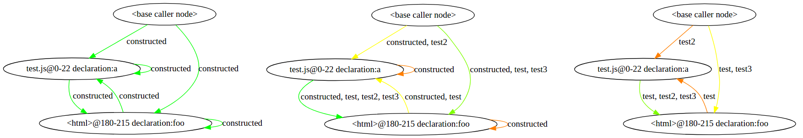

# Lacuna: JavaScript dead code elimination framework
Lacuna is a Node.js application that runs several source code analyzers on a given HTML webapplication and removes unused functions.
```
- Warning: this tool re-writes files. It does NOT create a copy of your data first. Please back up your code before running.
```


## Introduction
Lacuna processes a webapplication by first finding all JavaScript code (based on the main HTML file). Then, it feeds this data into the different analyzers, which report which function calls which function. In the end, Lacuna combines all these reports, and removes all functions that are unreachable. This setup allows different analyzers to complement each other, based on their strengts.


### Technical overview
Because no single analysis tool can ever be certain it found the complete call graph, we start out with a complete digraph (i.e. all nodes (functions) are connected). We mark these edges as _constructed_. Each analysis tool ('analyzer') is allowed to mark edges between functions, if it thinks the function is called. In the end, all edges marked only as _constructed_ are removed. An extra node is added to each graph, called the _base caller node_, which represents calling functions from the global scope.



## Restrictions
Lacuna does not work with ES6 modules. If you're using modules, consider using [Rollup](https://github.com/rollup/rollup). Lacuna also assumes the webapp resides in a folder and is valid (i.e. has no JS parse errors). Some analyzers have additional requirements, as indicated below.


## Prerequisites
Requires the following software on the host system:

+ Node.js
+ npm


## Installing
Run the following commands to install dependencies for the application and analyzers.
```
npm install

npm --prefix ./analyzers/static install ./analyzers/static
npm --prefix ./analyzers/dynamic install ./analyzers/dynamic
npm --prefix ./analyzers/nativecalls install ./analyzers/nativecalls
npm --prefix ./analyzers/wala_full install ./analyzers/wala_full
npm --prefix ./analyzers/wala_single install ./analyzers/wala_single
```


## Running
The application rewrites files in the specified directory. It's best to copy it before running, e.g. `cp -rf myapp myapp_modified` before `node ./lacuna.js myapp_modified`.
```
node ./lacuna.js <directory> [options]
```
_<directory>_ is the directory the application analyzes (mandatory); this should be a relative path. _options_ allow you to specify more settings, as indicated below.


### Runtime options

| Long         | Short | Description                                              | Default             |
|--------------|-------|----------------------------------------------------------|---------------------|
| --index      | -i    | Specify the main HTML file.                              | index.html          |
| --verbose    | -v    | Show output to stdout.                                   |                     |
| --csv        | -c    | Enable output to CSV file.                               |                     |
| --csvfile    | -f    | Specify CSV file to append data to (only with --csv).    | output.csv          |
| --graph      | -g    | Enable function graph output.                            |                     |
| --graphfile  | -d    | Specify graph (DOT) output location (only with --graph). | output.dot          |
| --analyzer   | -a    | Specify analyzers (multiple allowed, space separated).   |                     |
| --entire     | -e    | Output disconnected nodes in graph (only with --graph).  |                     |
| --noremove   | -n    | Don't remove uncalled nodes.                             |                     |
| --timeout    | -t    | Pass a timeout value to algorithms (not enforced).       |                     |
| --pace       | -p    | Display when an algorithm starts running.                |                     |
| --missteps   | -m    | When set, display algorithm errors.                      |                     |


#### CSV export
The csv file has the following columns:
```
directory name, JS scripts processed, # functions, # functions removed, run time (in ms), algorithm run info, error messages
```

#### Graph output
The graph file is outputted in DOT format, which you can visualize online [here](http://www.webgraphviz.com/) or on the command line with `dot` (e.g. `dot -Tpng output.dot -o output.png`).
Note that this might not work (or will take a long time) for large graphs.


### Example
Directory _myapp_ with index file _app.html_, appending result data to _results.csv_, with the `static`, `nativecalls` and `dynamic` algorithms:
```
node ./lacuna.js myapp --index app.html --csv --csvfile results.csv --analyzer static nativecalls dynamic
```


## Analyzers
The following analyzers are available and can be specified with the `--analyzer` option:


### Static (`static`)
Static analyzer; see [abort/javascript-call-graph](https://github.com/abort/javascript-call-graph/).


### Dynamic (`dynamic`)
Dynamic analysis by running a headless browser instance (using Selenium and PhantomJS) after inserting log calls to all functions. After the page is loaded, retrieves the log calls, and marks functions called.
Unfortunately, it cannot report caller functions (only called functions), so it assumes each called function was called from the global scope. This has no functional impact, but does mix up the output graph.
Also note that killing the application while the dynamic analyzer is running might corrupt the source folder.

*Additional requirements*: Requires a valid <head> tag in the HTML file.


### Native calls (`nativecalls`)
Static analyzer that only deals with native functions (e.g. `Array.prototype.map` or `setTimeout`) calling user-defined function expressions. Uses the same back-end as the _static_ analyzer.


### WALA: single file (`wala_single`)
WALA call graph analyzer, per JavaScript file. This is a slow and resource-heavy analyzer, and it is recommended to set a reasonable timeout (`--timeout`).
It does not link calls between files; to enable this, use the `wala_full` analyzer instead.

*Additional requirements*: `java` installed.


### WALA: full (`wala_full`)
WALA call graph analyzer, for the full HTML file. This is a very slow and resource-heavy analyzer, and it is recommended to set a reasonable timeout (`--timeout`).

*Additional requirements*: `java` installed, all `<script>` tags should be JavaScript.


## Custom analyzers
You can add custom analyzer by writing an connector to your backend. Lacuna provides connectors with information regarding the application (e.g. a list of scripts, the directory, the graph nodes) and expects the connector to mark the edges between the caller and called functions.
See the [`static` analyzer connector](analyzers/static.js) for a clean example of the required export signature, or the [`example` connector source](analyzers/example.js) for an example and full list of provided information.

The connector file should be placed in the `algorithms` directory. To prevent collisions, any dependencies should be placed in a folder with the same name, e.g. for the `example` analyzer, place dependencies in `analyzer/example/`.
Then, use the --analyzer flag to specify the new analyzer.

Analyzers should only mark edges (with the provided `find_node` and `mark` functions), and not change anything else (before returning).


# License
Lacuna is licensed under the [EPL 1.0](epl-v10.html).


This project makes use of several other open-source projects. The following projects have their (modified) source code included within this repository:

+ IBM's [WALA](https://github.com/wala/WALA), licensed under the _Eclipse Public License 1.0_.
+ [Javascript Call Graph](https://github.com/abort/javascript-call-graph/), licensed under the _Eclipse Public License 1.0_.
